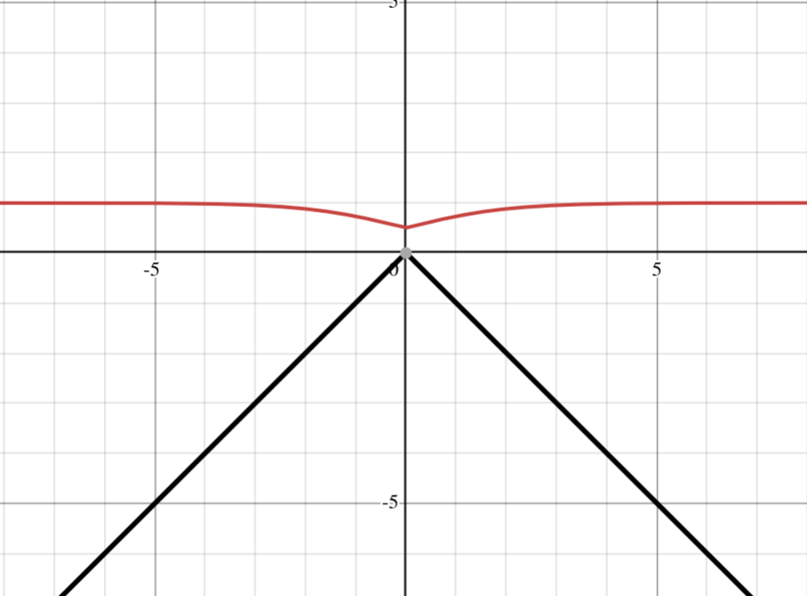

+++
date = '2025-04-30T16:54:05+01:00'
draft = false
title = 'Using the Power of Maths To Fix Picom'
[params]
  math = true
image = 'header.png'
tags = [
    "maths",
]
+++
# The maths, The code and the problem

Welcome.

I've been dabbling with [picom](https://github.com/yshui/picom) the [compositor](https://en.wikipedia.org/wiki/Compositing_manager). That means it does magic X11 things to make
your windows look nicer, such as drop shadows, transparency and, today's topic of interest, __animations__. As said in the title this is gonna involve maths and that is scary to some, but I assure you this is fun! ~~Hopfully~~.

## The problem

So the problem I ran into and why I'm writing this blog post is picom animations for moving, resizing, and dragging windows in bspwm.
Now this sounds easy untill you realise picom doesn't have specific triggers for resizing or moving windows, it all has to be done by the same animation.

So my first thought was 'just use the preset animation `geometry`':

```text {linenos=inline}
animations =(
    ...
    {
        triggers = [ "geometry" ];
        preset = "geometry-change";
    }
)
```

Now I would show you a video of the result of this, however I cannot be bothered, so I shall explain instead. This function is constant time no matter how small the move or tiny the window geometry changes it will always take however long you tell it.

This sounds fine, and it is for moving window positions on screen, but it absoulty breaks resizing windows. As you drag a window it triggers this animation many times a second and of course it takes x amount of seconds to finish that animation of the tiny move. This leads to resizing lagging heavily behind where your mouse is, it just looks horrible and feels mushy.

What we need is a time funtion that scales relative to how big the move is.

## The code

So as a precursor to the math we need some code. I was going to use the `geometry-change` preset, but it annoys me. It takes a screenshot
and shows that the window scales. It leads to some very odd results. From what I gather this is needed as the animations get applied after the window scales/moves so if a window moves from big to small it will, shrink then play the  scale and move animation. This leads to the small window being streached to play the animation. The issue is, the 'solution' is just the original problem just in the opposite direction, so I'd rather skip this.

So after digging around the [picom](https://github.com/yshui/picom/) I found the [presets](https://github.com/yshui/picom/blob/next/data/animation_presets.conf) config. The `geometry-change` looks like this:

```text {linenos=inline}
geometry-change = {
    scale-x = {
        curve = "cubic-bezier(0.07, 0.65, 0, 1)";
        duration = "placeholder0";
        start = "window-width-before / window-width";
        end = 1;
    };
    scale-y = {
        curve = "cubic-bezier(0.07, 0.65, 0, 1)";
        duration = "placeholder0";
        start = "window-height-before / window-height";
        end = 1;
    };
    shadow-scale-x = "scale-x";
    shadow-scale-y = "scale-y";
    offset-x = {
        curve = "cubic-bezier(0.07, 0.65, 0, 1)";
        duration = "placeholder0";
        start = "window-x-before - window-x";
        end = 0;
    };
    offset-y = {
        curve = "cubic-bezier(0.07, 0.65, 0, 1)";
        duration = "placeholder0";
        start = "window-y-before - window-y";
        end = 0;
    };
    saved-image-blend = {
        duration = "placeholder0";
        start = 1;
        end = 0;
    };
    shadow-offset-x = "offset-x";
    shadow-offset-y = "offset-y";
    *knobs = {
        duration = 0.4;
    };
    *placeholders = ((0, "duration"));
};
```

So after removing the `saved-image-blend` section I have something akin to what I want, but there is still problems to solve.

## The maths

Time to deal with that pesky distant dependant duration function.

So picom gives you a few mathematical operations `+ - * / and ^`. My first thought is we need to get the distance of how for the window is moving so:

```
x_diff='window-x - window-x-before'
y_diff='window-y - window-y-before'
diff='x_diff + y_diff'
```
This is a bit naive, window positions start in a corner (I can't remember what corner, but it shouldn't matter) this is makes calculating windows translating away from this origin easy but breaks for windows moving closer as the diff is negative.

What we need is an abs function. I spent quite a while searching on how to do this. Knowing I could do:

\[
abs(x) = \sqrt{x^2}
\]
but picom didn't have square root?? After quite a lot longer, embarrassingly, the answer is staring us in the face.
\[
    \sqrt[b]{x} = x^{\frac{1}{b}}
\]

I felt so stupid only now remembering this. Anyway we can refactor to:

\[
    abs(x) = (x^2)^{\frac{1}{2}}
\]

So my idea is to make a function that has a dead band where small moves are virtually instant and big moves past the dead band take the same time. A function that may come to mind is the sigmoid function

\[
    y = \frac{1}{1+e^{-x}}
\]

with this we can substitute our abs distance into the sigmoid function and fuck off _e_ like so :

\[
    y = \frac{1}{1+5^{-((x^2)^{\frac{1}{2}})}}
\]
Choosing 5 as _e_ as it gives a steeper transition. After this lets lob it into [desmos](https://www.desmos.com/calculator).



our function is in red and the _abs_ function is in blue

Honestly not exactly what I wanted, but it makes sense. If we substitute the lowest value of the _abs_ function we get why

\[
\begin{aligned}
y &= \frac{1}{1+5^{-((x^2)^{\frac{1}{2}})}} \\
y &= \frac{1}{1+5^{-0}} \\
y &= \frac{1}{1+5^{0}} \\
y &= \frac{1}{1+1} \\
y &= \frac{1}{2} \\
y &= 0.5
\end{aligned}
\]

Simple solution move the abs function down by amount _d_ this can also be scaled to set the dead space width.

\[
    ds(x, d) = \frac{1}{1+5^{d-((x^2)^{\frac{1}{2}})}}
\]

which yields:


Great success! After converting this to code we get

```text {linenos=inline}
dead_band = 350;
animation_target_duration=0.2
x-diff-abs = "(((window-x-befor - window-x)^2)^0.5)";
y-diff-abs = "(((window-y-befor - window-y)^2)^0.5)";
anim-duration = "animation_target_duration*(1/(1+(5^(dead_band - (x-diff-abs + y-diff-abs)))))";
```
This kinda works, a new issue has arisen the `window-x` and `window-y` are from the top left corner of the window. Seams like not a problem but consider this setup:


The issue is our function calculates this as a tiny move because the top left of the windows are not moving much. What we need to do is calculate the centre of the windows then calculate the diff on that. Luckly this is simple and gives us our final iteration of the code:

```text {linenos=inline}
{
  triggers = [ "geometry" ];
  dead_band = 350;
  animation_target_duration=0.2
  win_x_center_before = "(window-x-before + (window-width-before / 2))"
  win_x_center_after = "(window-x + (window-width / 2))"
  win_y_center_before = "(window-y-before+(window-height-before / 2))"
  win_y_center_after = "(window-y + (window-height / 2))"
  x-diff-abs = "(((win_x_center_before - win_x_center_after)^2)^0.5)";
  y-diff-abs = "(((win_y_center_before - win_y_center_after)^2)^0.5)";
  anim-duration = "animation_target_duration*(1/(1+(5^(dead_band - (x-diff-abs + y-diff-abs)))))";

  scale-x = {
      curve = "cubic-bezier(0.33, 0, 1, 0.66)";
      duration = "anim-duration";
      start = "window-width-before / window-width";
      end = 1;
  };
  scale-y = {
      curve = "cubic-bezier(0.33, 0, 1, 0.66)";
      duration = "anim-duration";
      start = "window-height-before / window-height";
      end = 1;
  };
  shadow-scale-x = "scale-x";
  shadow-scale-y = "scale-y";
  offset-x = {
      curve = "cubic-bezier(0.33, 0, 1, 0.66)";
      duration = "anim-duration";
      start = "window-x-before - window-x";
      end = 0;
  };
  offset-y = {
      curve = "cubic-bezier(0.33, 0, 1, 0.66)";
      duration = "anim-duration";
      start = "window-y-before - window-y";
      end = 0;
  };
  shadow-offset-x = "offset-x";
  shadow-offset-y = "offset-y";
  suppressions = ["increase-opacity", "decrease-opacity"]

}
```

## the end

The code is good now!

Fin
